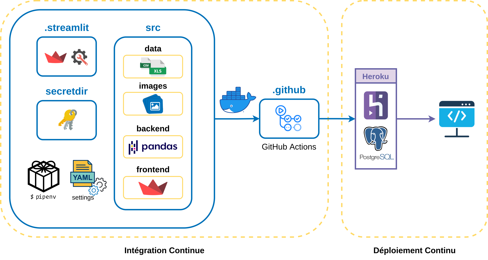

# Project HETIC MD5 for Converteo x Castorama

## Summary
This application is a monitoring tool built by a group of students at HETIC for the consulting agency Converteo. The aim of this tool is to track consumer insights on Castorama, a French retailer of DIY and home improvement tools and supplies.

## Students
- Adrien DEMAEGDT
- Étienne ROSEAU
- Kahina BEHTANI
- Mohamed Khalil ASLI
- Zhifeng LIANG

## Deployed application
https://castorama-reviews.herokuapp.com/

## Project structure

## Run the application locally
1. Add the excel file "raw_datas_projet_M5D_Hetic.xlsx" in the [src/data](src/data/) folder.
2. Download the json file "correspondance-code-insee-code-postal.json" from [opendata](https://public.opendatasoft.com/explore/dataset/correspondance-code-insee-code-postal/export/) and add it in the [src/data](src/data/) folder.
3. Add a "secrets.yml" with your own credentials in the [secretdir](secretdir/) folder, following the [example](secretdir/secrets.yml.example).
2. Install pipenv if not yet installed: `pip install pipenv`
3. Create a virtual environment: `pipenv install`
4. Enter the virtual environment: `pipenv shell`
5. Launch the Streamlit application: `streamlit run src/frontend/🏠Home.py`

## Team planning
https://miro.com/app/board/uXjVOniXd3s=/